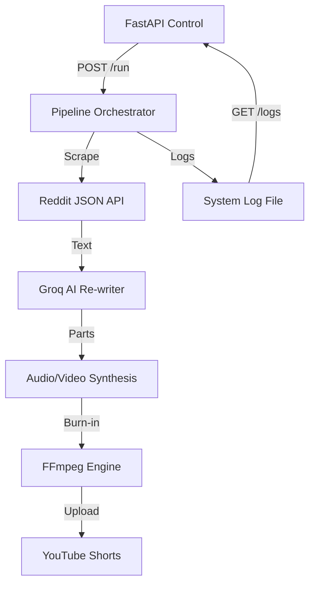

# Project Alpha: AI Slop Pipeline Control Center - Frontend Briefing

## 🎯 Objective
Build a "Futuristic Command Center" dashboard for the automated Reddit Story-to-Video pipeline. The UI must look like a high-end cyberpunk console—highly visual, responsive, and data-dense.

## 🛠 Backend Architecture
- **Language**: Python 3.11
- **API Framework**: FastAPI (Uvicorn)
- **Database**: PostgreSQL (Supabase)
- **Primary Logic**: Scrapes Reddit, uses Groq AI for rewriting, processes with FFmpeg, and uploads to YouTube/Drive.

## 📡 API Endpoints (Base URL: `http://localhost:8000`)

### 1. `GET /status`
Returns the current state of the pipeline.
```json
{
  "is_running": true,
  "last_run_start": "2026-01-07T18:15:00",
  "last_run_end": null,
  "last_error": null,
  "current_stage": "Video Assembly"
}
```

### 2. `POST /run`
Triggers a new pipeline execution cycle in a background thread.
- **Payload**: None
- **Response**: `{"message": "Pipeline triggered successfully."}`

### 3. `POST /stop`
Immediately cancels the currently running pipeline thread.
- **Payload**: None
- **Response**: `{"message": "Stop signal sent to pipeline."}`

### 4. `GET /logs?lines=100`
Returns the latest raw system logs.
```json
{
  "logs": [
    "2026-01-07 18:15:21 - INFO - Generating audio for Part 42...",
    "2026-01-07 18:16:05 - INFO - Burning subtitles with FFmpeg..."
  ]
}
```

## 🌌 User Experience & Design Vision
The user wants a "Futuristic and Cool" look. Think **Cyberpunk Command Center** or **Starship Bridge**.

### **Core UI Components:**
1.  **The "Pulse" Indicator**: A large, animated "CORE STATUS" orb or wave that glows green when idle and pulses red/neon when the pipeline is processing.
2.  **Process Stages**: A vertical stepper showing: `SCRAPE` -> `AI REWRITE` -> `AUDIO SYNC` -> `VIDEO BURN` -> `UPLOAD`.
3.  **Terminal Feed**: An embedded console window displaying the `GET /logs` stream with auto-scroll.
4.  **Control Matrix**: Two high-contrast buttons: "INITIALIZE RUN" (Neon Green) and "EMERGENCY STOP" (Glowing Red).
5.  **Data Grid**: (Optional) Cards showing processed stories with their upvote counts and subreddits.

### **Styling Keywords:**
- **Colors**: Deep Matrix Green (#00FF41), Cyberpunk Yellow/Pink, Carbon Fiber Black.
- **Effects**: Glassmorphism (semi-transparent backgrounds), blurred backdrops, glowing borders, CRT scanline overlays.
- **Animations**: Subtle digital glitches, floating data particles, smooth transforms.

## 📊 Pipeline Logic Flow


## 🚀 Execution Instructions for Frontend LLM
1.  Use **Vite + React/Next.js** for the frontend.
2.  Use **SWR** or **React Query** for polling the `/status` and `/logs` endpoints.
3.  Prioritize **Aesthetics**—if it looks like a standard bootstrap app, it’s a failure. It needs to feel like an "AI Slop Factory" control rig.
